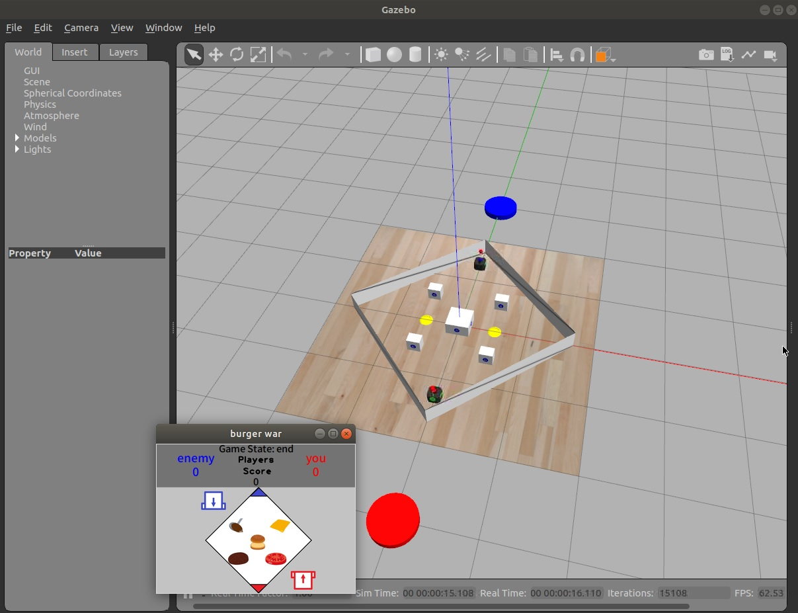

# burger_war
ロボットで戦車対戦をするゲームです。
大砲で撃つ代わりに、カメラでターゲットのARマーカーを読み取ります。<BR>

## 推奨動作環境
- Ubuntu 18.04 
- Ros melodic

## インストール
下記ではシミュレーター環境の構築を説明します。
ロボット実機の説明は最後に補足として掲載しています。

下記では、PCにインストールされたUbuntu 18.04の上で環境構築を行います。
他のバージョンのUbuntuやLinuxでは下記の手順と異なります。

Ubuntu 18.04がインストールされたPCを準備してください。

### 1. ros (melodic) のインストール
rosのインストールが終わっている人は`2.リポジトリをクローン` まで飛ばしてください。

参考  ROS公式サイト<http://wiki.ros.org/melodic/Installation/Ubuntu>
上記サイトと同じ手順です。

#### ros インストール
```
sudo sh -c 'echo "deb http://packages.ros.org/ros/ubuntu $(lsb_release -sc) main" > /etc/apt/sources.list.d/ros-latest.list'
sudo apt-key adv --keyserver 'hkp://keyserver.ubuntu.com:80' --recv-key C1CF6E31E6BADE8868B172B4F42ED6FBAB17C654
sudo apt update
sudo apt install ros-melodic-desktop-full
```

#### 環境設定
```
echo "source /opt/ros/melodic/setup.bash" >> ~/.bashrc
source ~/.bashrc

sudo apt install python-rosdep python-rosinstall python-rosinstall-generator python-wstool build-essential python-catkin-tools

sudo rosdep init
rosdep update

```

#### ワークスペース作成
参考<https://catkin-tools.readthedocs.io/en/latest/quick_start.html>
```
mkdir -p ~/catkin_ws/src
cd ~/catkin_ws
catkin init
catkin build
echo "source ~/catkin_ws/devel/setup.bash" >> ~/.bashrc
source ~/.bashrc
```
(補足)今大会よりcatkin_toolsの使用をデフォルトに変更しました

### 2. リポジトリをクローン
gitをインストールします。
```
sudo apt-get install git
```

burger_war リポジトリをクローンします。
先程作ったワークスペースの`src/`の下においてください。
```
cd ~/catkin_ws/src
git clone https://github.com/p-robotics-hub/burger_war_kit
```

下記は、実際にはForkした自分のレポジトリをcloneしてください
```
git clone https://github.com/p-robotics-hub/burger_war_dev
```

Turtlebot3のモデル名の指定を環境変数に追加。
```
echo "export TURTLEBOT3_MODEL=burger" >> ~/.bashrc
source ~/.bashrc
```
(補足)GAZEBO_MODEL_PATHの指定はpackage.xml内で行うようにしたので不要になりました。

### 3. 依存ライブラリのインストール
- pip : pythonのパッケージ管理ツール
- requests : HTTP lib
- flask : HTTP server 審判サーバーで使用
- turtlebot3
- aruco

```
# pip のインストール 
sudo apt-get install python-pip
#　requests flask のインストール
sudo pip install requests flask
# turtlebot3 関係パッケージのインストール
sudo apt install \
 ros-melodic-turtlebot3 ros-melodic-turtlebot3-msgs  ros-melodic-turtlebot3-simulations \
 ros-melodic-teleop-twist-keyboard ros-melodic-amcl ros-melodic-map-server \
 ros-melodic-move-base ros-melodic-urdf ros-melodic-xacro \
 ros-melodic-compressed-image-transport ros-melodic-rqt-image-view \
 ros-melodic-gmapping ros-melodic-navigation ros-melodic-interactive-markers
# aruco (ARマーカー読み取りライブラリ）
sudo apt install ros-melodic-aruco-ros
```


### 5. ビルドする
```
cd ~/catkin_ws
catkin build
```

インストールは以上です。

## サンプルの実行
### シミュレータ
シミュレータ､ロボット(turtle_bot)、審判サーバー､審判画面のすべてを一発で起動するスクリプトを実行します。
最初にburger_warのフォルダまで移動します。
```
cd ~/catkin_ws/src/burger_war_kit
```

初回のみ、以下のコマンドでGazeboを起動し、モデルデータ等を読み込んでおくとよいです。
(初回はGazeboの起動がおそいためです。インターネット接続が必要です。)
```
gazebo
```

gazeboの初回立ち上げには数分かかることもあります。gazeboが空のフィールドで立ち上がったら一度gazeboを終了(ターミナルでCtrl+c)します。


次にシミュレーションを起動します。
```
bash scripts/sim_with_judge.sh
```



↑このようなフィールドが現れロボットが2台出現します。
赤側が自機、青側が敵機です。
審判画面も表示されます。

フィールドとロボットが立ち上がったら
別のターミナルで下記ロボット動作スクリプトを実行すると、プログラムが動き始めます。
デフォルトのサンプルプログラムは、自機はランダムで動作します。
```
cd ~/catkin_ws/src/burger_war_kit
bash scripts/start.sh
```

敵プログラムはレベル1-3まで３種類用意しています。（デフォルトではレベル１）
下記のように `-l` 引数によって変更できます。

```
#level 2
bash scripts/start.sh -l 2

#level 3
bash scripts/start.sh -l 3
```

### シミュレーターの終了
Gazeboおよび審判画面を閉じて、ターミナルでCtrl+cを押すと終了します。ターミナルは複数立ち上がっていますが、全てCtrl+cで終了させます。
終了には時間がかかります。

### シミュレーターのリセット
シミュレーターの終了と起動は時間がかかりますが、リセットすることがでその時間を省くことができます。
まず、ロボット動作プログラム(`bash scripts/start.sh`)をターミナル上でCtrl+cを押して終了させます。
次に、Gazeboのウインドウメニューの`Edit->Reset World`でシミュレーターがリセットされます。

審判サーバーは下記のコマンドでリセットできます。
```
bash judge/test_scripts/init_single_play.sh judge/marker_set/sim.csv localhost:5000 you enemy
```

上記コマンドの他、審判サーバーはブラウザーからもコントロールできます。下記にアクセスしてください。
http://localhost:5000/


**審判サーバーを立ち上げずにシミュレータとロボットのみ立ち上げる場合**
```
roslaunch burger_war setup_sim.launch
```
(審判サーバーと通信できないエラーが発生しますが無視して構いません)

フィールドとロボットが立ち上がったら
別のターミナルで下記ロボット動作スクリプトを実行
```
roslaunch burger_war sim_robot_run.launch enemy_level:=1
```
(ememy_levelは上記と同じく敵プログラムのレベルです。1～3を指定できます)


## ファイル構成

参加者は、burger_war_dev以下のディレクトリで開発を行ってください。
最低限変更の必要があるファイルは下記です。

- burger_war_dev/burger_war_dev/launch/your_burger.launch
  - 参加者のロボット動作プログラムを起動するためのLaunchファイルです
- burger_war_dev/burger_war_dev/scripts/*.py
  - ロボット動作プログラムはここに置きます。randomRun.pyがサンプルです。

開発環境のディレクトリ構成は下記のようになっています。  

```
burger_war_dev https://github.com/p-robotics-hub/burger_war_kit を参加者がForkしたレポジトリ
├── burger_war_dev この名称のPackageは必ず必要です
│   ├── launch  launchファイルの置き場
│   │   └── your_burger.launch  【このファイルで起動するノードを制御します】参加者用launchファイル
│   ├── scripts    【ここにプログラムを書いていきます】pythonで書かれたROSノード
│   ├── src    【ここにプログラムを書いていきます】C++で書かれたROSノード
│   └── launch  launchファイルの置き場
│       └── your_burger.launch  【このファイルで起動するノードを制御します】
│
└── burger_war_navigation 自律移動のサンプルプログラムが入ったPackage
    ├── launch  launchファイルの置き場
    │   ├── burger_navigation.launch  自律移動を起動するLaunchファイル
    │   └── burger_slam.launch  地図を生成するためのLaunchファイル
    ├── maps    自律移動で使う地図
    ├── param   自律移動のパラメーターファイル
    └── rviz    RVizの設定ファイル


burger_war_kit 【このレポジトリ】ロボットモデルやワールドモデル（変更不可）
├── burger_war
│   ├── launch  launchファイルの置き場
│   │   ├── setup.launch  実機でロボットを起動、初期化するlaunchファイル
│   │   ├── sim_robot_run.launch  シミュレータ上で２台のロボットを動かすlaunchファイル
│   │   └─ setup_sim.launch  Gazeboシミュレータ上でフィールドの生成ロボットを起動、初期化するlaunchファイル
│   │
│   ├── models   GAZEBOシミュレーター用のモデルファイル
│   ├── package.xml
│   ├── scripts    pythonで書かれたROSノード
│   └── world     GAZEBO用の環境ファイル
│       ├── gen.sh          burger_field.world.emから burger_field.worldを作成するスクリプト
│       ├── burger_field.world  最新のworldファイル
│       └── burger_field.world.em  worldファイルのマクロ表記版､こっちを編集する
|
├── judge   審判サーバー
│   ├── judgeServer.py  審判サーバー本体
│   ├── log   ログがここにたまる
│   ├── marker_set  マーカーの配置設定ファイル置き場
│   ├── picture  観戦画面用画像素材
│   ├── README.md  
│   ├── test_scripts   初期化などのスクリプト
│   └── JudgeWindow.py  観戦画面表示プログラム
|
├── README.md   これ
├── rulebook.md  ルールブック
└── scripts      一発起動スクリプト
    ├─── sim_with_judge.sh   シミュレーターとロボットと審判サーバーの立ち上げ初期化をすべて行う
    └──  start.sh             赤サイド、青サイドのロボットを動作させるノードを立ち上げるスクリプト
```

## 補足情報
### Turtlebot3のスペック
- https://emanual.robotis.com/docs/en/platform/turtlebot3/features/


### 実機の動かし方
センサなどが立ち上がりロボットを動かす準備 `burger_war setup.launch`
引数
- `side`: (default: 'b') ロボットが赤サイドか青サイドか表す引数。審判サーバーに提出する際にどちらサイドか表すために使用する。赤サイドなら `r` 青サイドなら `b`
- `ip`: (default:'http://localhost:5000') 審判サーバーのアドレス。

```
roslaunch burger_war setup.launch ip:=http://127.0.0.1:5000 side:=r
```

審判サーバーを使わない走行テストのみの場合は引数は省略可
```
roslaunch burger_war setup.launch
```

別のターミナルでロボットを動かすノードを起動 `burger_war your_burger.launch`

引数
- `side`: (default: 'b') ロボットが赤サイドか青サイドか表す引数。赤サイドと青サイドによって戦略やパラメータを切り替えるためなどに使用する。赤サイドなら `r` 青サイドなら `b`

赤サイドの場合
```
roslaunch burger_war your_burger.launch side:=r
```
青サイドの場合
```
roslaunch burger_war your_burger.launch side:=b
```

### 審判サーバー
審判サーバーは`judge/`以下にあります
そちらのREADMEを参照ください

